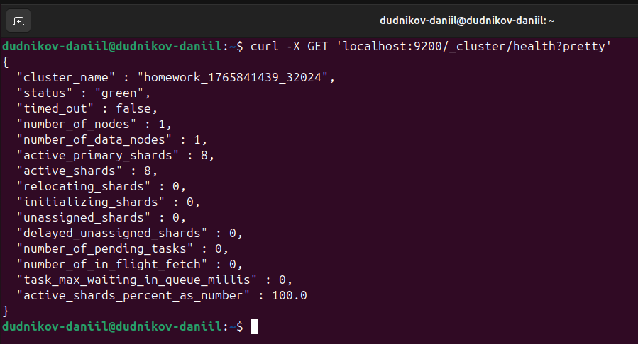
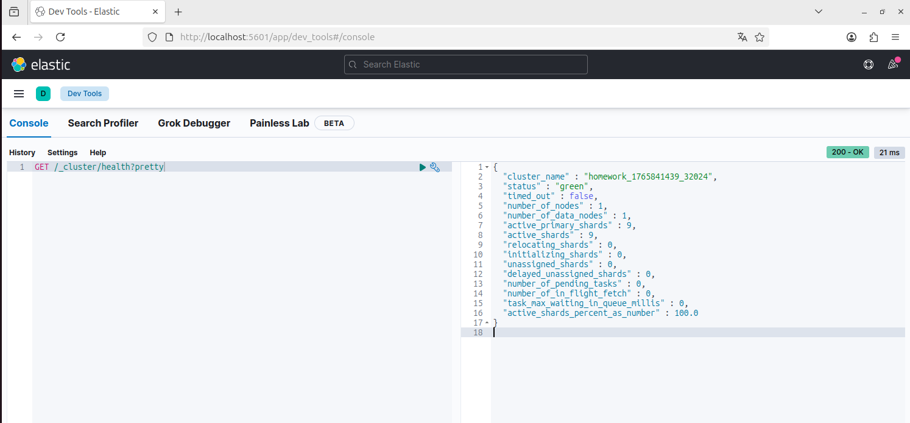
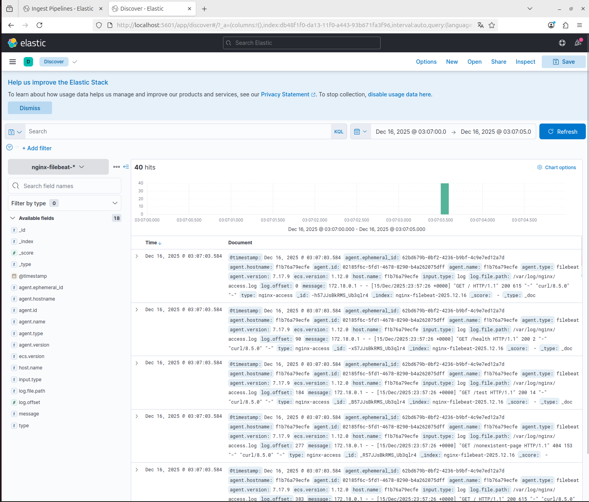

# Домашнее задание к занятию «ELK»

**Студент:** Даниил Дудников
---

## Цель работы
Установка и настройка стека ELK (Elasticsearch, Logstash, Kibana, Filebeat) для сбора и анализа логов.

---

## Задание 1. Установка и настройка Elasticsearch

### Задача:
Установить Elasticsearch, изменить параметр `cluster_name` на случайный и проверить работоспособность.

### Результат:

**Вывод:** Elasticsearch успешно установлен и работает. Параметр `cluster_name` изменен на нестандартное значение `homework_1765841439_32024`.

---

## Задание 2. Установка и настройка Kibana

### Задача:
Установить Kibana и проверить подключение к Elasticsearch через веб-интерфейс.

### Результат:

**Вывод:** Kibana успешно установлен и работает. Запросы к Elasticsearch выполняются корректно через веб-интерфейс Kibana Dev Tools.

---

## Задание 3. Настройка Logstash для сбора логов Nginx

### Задача:
Настроить Logstash для парсинга access-логов Nginx и отправки их в Elasticsearch.

### Результат:

**Вывод:** Logstash успешно настроен для парсинга логов Nginx. В Kibana отображаются логи с различными HTTP-запросами (GET /, GET /health, GET /nonexistent-page и др.).

---

## Задание 4. Настройка Filebeat для сбора логов

### Задача:
Заменить Logstash на Filebeat для сбора логов Nginx.

### Результат:

**Вывод:** Filebeat успешно заменяет Logstash. Логи поступают в Elasticsearch с новой структурой полей (agent.type: "filebeat", agent.version: "7.17.9" и др.).

---
## Структура проекта

ELK-Homework/
├── README.md # Документация
├── screenshots/ # Скриншоты выполнения заданий
│ ├── task1.png # Elasticsearch
│ ├── task2.png # Kibana
│ ├── task3.png # Logstash + Nginx
│ └── task4.png # Filebeat

---

## Технические детали

### Используемое ПО:
- **Elasticsearch:** Версия 7.x
- **Kibana:** Версия 7.x
- **Logstash:** Версия 7.x
- **Filebeat:** Версия 7.17.9
- **Nginx:** Веб-сервер для генерации логов
- **ОС:** Ubuntu Linux

### Выполненные действия:
1. Установка всех компонентов стека ELK
2. Настройка конфигурационных файлов
3. Изменение стандартных параметров (cluster_name)
4. Настройка парсинга логов Nginx
5. Интеграция Filebeat вместо Logstash
6. Визуализация результатов в Kibana

### Полученные навыки:
- Работа с Elasticsearch API
- Настройка Kibana Dev Tools
- Конфигурация Logstash pipelines
- Использование Filebeat для сбора логов
- Анализ логов через Kibana Discover
